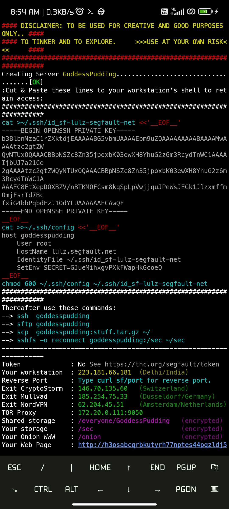
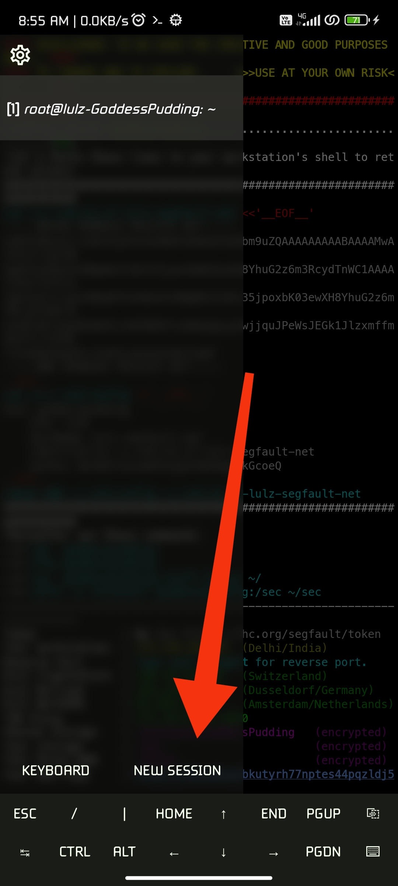
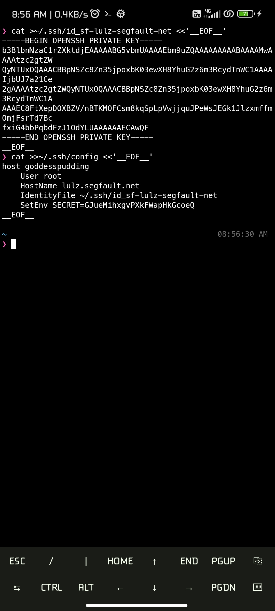
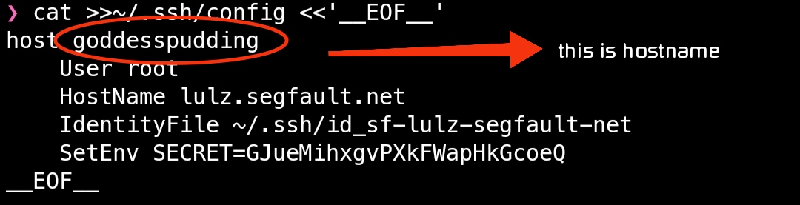
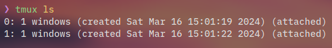

<h1 align="center">Setting up SEGFAULT to use crave on <a href="https://github.com/termux/termux-app">termux</a></h1>
<div align="center">

   As of now, the crave binary doesn't work on termux.  
So, we will use `SEGFAULT` to use crave. (Read more about [segfault](http://thc.org/sf))
   
</div>


### Here, We will be trying to cover these:
1. Connect to `segfault` via `ssh`.
2. Save the `first time login` info to your `termux environment`, so that you can always use the same instance.
3. Install crave.
4. At last, we will use `tmux`, as it's really useful (you should use it).


### NOTE: 
- It's necessary for you to ssh to your old segfault instance because if you start up a new instance every time, you will loose the files which you placed in your earlier instance.
Also, running more than one instance per user is considered 'ABUSE' by segfault, so just do as I say. 😃😁


So, Now, open termux and start copy pasting 😜

(I am assuming that you are in termux now.)

### ➤ 1. Connect to `segfault` via `ssh`:

 - run `ssh root@segfault.net`
 - then it will show you a big message (don't worry about it, also it doesn't needs any explanation), just type `yes` and press enter
 - now it will ask for password, which is `segfault` (all lowercase), just type the password and press enter.

By now you will be in the segfault's instance, congrats 🎊
NOTE: 
- When you connect it to for the first time, you will see a big, colourful message 👀 , which have the useful things we will need later, so please don't clear it or exit the session.



### ➤ 2. Save the `first time login` info to your `termux environment`:

#### ➤ STEP 1:
   * In our big, colourful message, you will see two `cat` commands & one `chmod` command
   * you are needed to run these commands in termux and not in the segfault's instance (please don't get confused, after running that ssh command, the shell you are now looking at is segfault's)
   * to open a new session of termux in current window, swipe from the left of the screen, and press new session (refer to the screenshot below)
    
   * now you can copy paste the things that were shown when you ssh'ed to segfault from your termux session (refer to the screenshot again)
    

#### ➤ STEP 2: 
   * After running those 3 commands, you are now good to go.
   * out of those three, there was a cat command, which looked something like this
    ```
    cat >>~/.ssh/config <<'__EOF__'
        host hostname      #(it's random)
        user root
        :
        :
    __EOF__
    ```
    
    From here we need 'hostname' (defiend in `host hostname` line) as you will need to write it everytime you want to ssh to your segfault instance.
    Note: If it's too long, or you find it difficult to remember or hard/long to type, you simply run `nano ~/.ssh/config` and then edit it (warning: just edit the text after host, DO NOT TOUCH anything else there)

#### ➤ STEP 3:
   * So, by now I think, you know your host's name, according to your SSH config.
   * you can connect to your instance by typing 
    ``` ssh hostname ``` in termux.

YAY !! 
Your segfault's setup is done.

### ➤ 3. Install crave:
   Now we will install crave and connect to the devspace.

#### ➤ STEP 1:
Run the following command to install crave.

Note: you just need to run it once in your instance. ONLY ONCE!!
```
bash <(curl -s https://raw.githubusercontent.com/omansh-krishn/crave/main/install.sh) 
```
Note: This command is only meant to be used on linux systems with amd64 cpu (ex: segfault), use the [official installation script](https://raw.githubusercontent.com/accupara/crave/master/get_crave.sh) for other systems.

#### ➤ STEP 2:
Now, you'll need the `crave.conf` from foss.crave.io
you can do so by going to https://foss.crave.io/app/#/apikeys
* Download the key
* use some text editor to copy it's contents
* now go to your segfault instance, run `nano crave.conf` & simply paste the things here (by the 'things', I refer to the json content of config)


So, now you finally have installed crave and also you have your config in your instance.

WaaaW, you are a pro, trust me.


----

#### ➤ STEP 3:
Connecting to crave's devspace

Now, you can connect to devspace by running
```./crave -c crave.conf devspace```
And finally you will land in crave's devspace.

YAAAY !! (again)

### ➤ Usage of `tmux`:

It's good if you happily reached here.
But I want you to do something else too, It's not necesary, but you should do it.
Not just beacause I want you to, you should because it will make your life easier.
YOU SHOULD USE `tmux` .
WHY ???? Because, you will not loose your terminal sesssion ever if you are using tmux, even if you exit your instance. This is really helpful.
Here, I will try to explain some simple tmux commands, but if you want detailed information or you can't understand what I am trying to say, just go to youtube & watch a video (or watch some videos).

I am saying again, you should use tmux. Else, everything will be a mess, here and there.

SO....

for running `tmux` (for the first time)
simply type `tmux` in your segfault instance

(yeah yeah, I know, it looks same, but still, keep reading)

Now, you are in a terminal called `tmux`, the speciality of this one is that, if you gets diconnected from your session, you can reconnect to this terminal again, and the process running in the terminal (tmux) will not be terminated.

now, just assume you was doing something in tmux, and your session got disconnected, or you simply exited from termux (see , it's termux!) (also, you should never exit from tmux, as it will make no sense, we are using tmux just becuase we don't have to exit.)

so now when you reconnect to your segfault instance, just type
```tmux a -t 0```
this command means, "My dear lovely tmux, please aTTACH the tERMINAL number '0' here".

Also, if you ran multiple instances tmux, (this is done by running `tmux` again and again )(if you still doesn't understand, then go and watch a YT video, because I want you to undesrtand {please}.)

You can list all tmux sessions by typing `tmux ls`
You will see a output some like this


so, if you want to attach 0, type `tmux a -t 0` or else if you want to attach instance 1 (as seen in the screenshot, it will surely vary in your case) type `tmux a -t 1`

So, Now, Finally, You are good to go. Happy building!! 🤓

-------------------------------------
### Note: 

Also, I know, if you are reading this, you might be building roms,
also, since you build them, you might even flash them,
and when you flash them, you will need to clear your /data, which will clear your termux data too. So, in that case, you will loose your segfault data placed in termux. So, I recommend you to save those 3 commands (which you copied from segfault & ran in termux) in a text file and keep it safe or either send them to your telegram's 'Saved messages'. If you will run those commands in termux (after changing your rom) or anywhere else (even in your pc),  you will still be able to login in back to your instance, as those commands contains the secrets which connects you to your segfault session/instance.

-----
If you want to ask something, you can contact me [here](https://omansh_krishn.t.me)